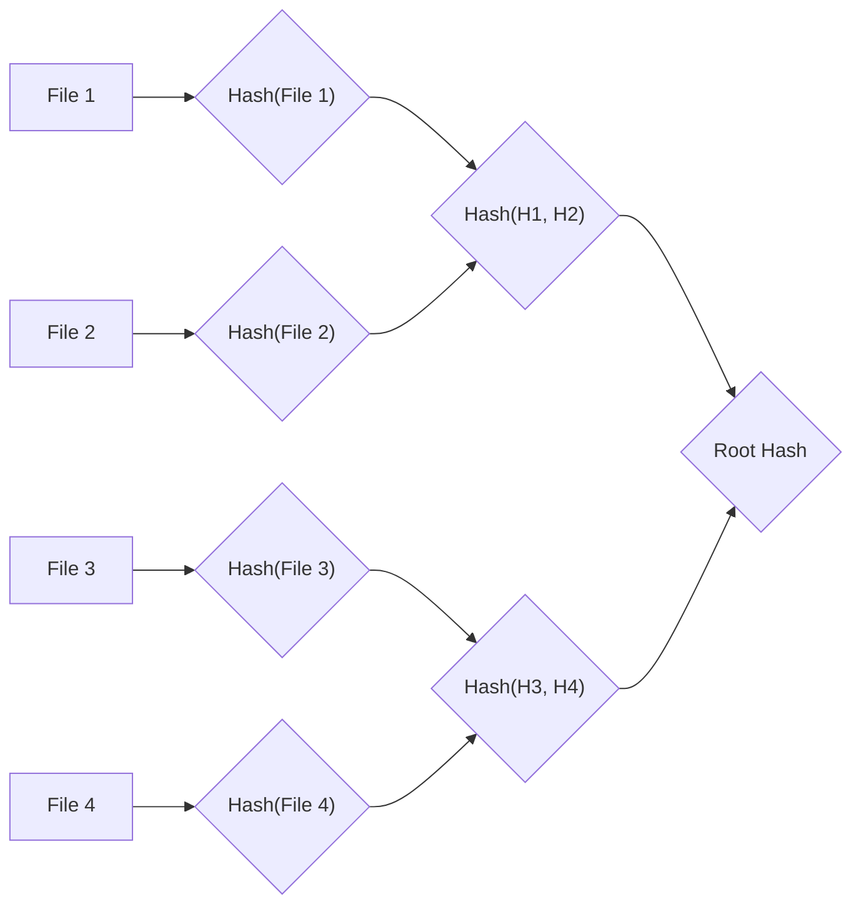

```mermaid
graph LR
    A["File 1"] --> H1{"Hash(File 1)"}
    B["File 2"] --> H2{"Hash(File 2)"}
    C["File 3"] --> H3{"Hash(File 3)"}
    D["File 4"] --> H4{"Hash(File 4)"}
    H1 --> H12{"Hash(H1, H2)"}
    H2 --> H12
    H3 --> H34{"Hash(H3, H4)"}
    H4 --> H34
    H12 --> root{"Root Hash"}
    H34 --> root

```
